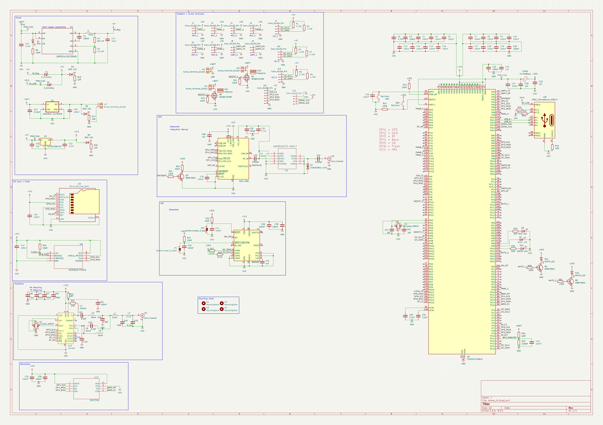
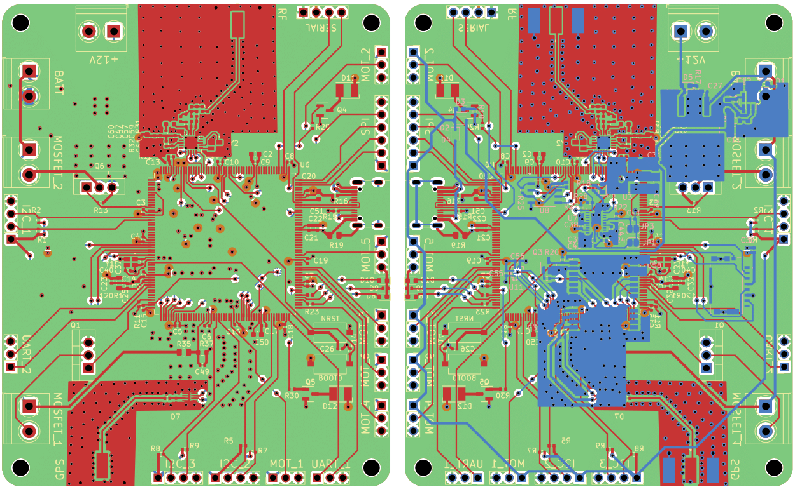
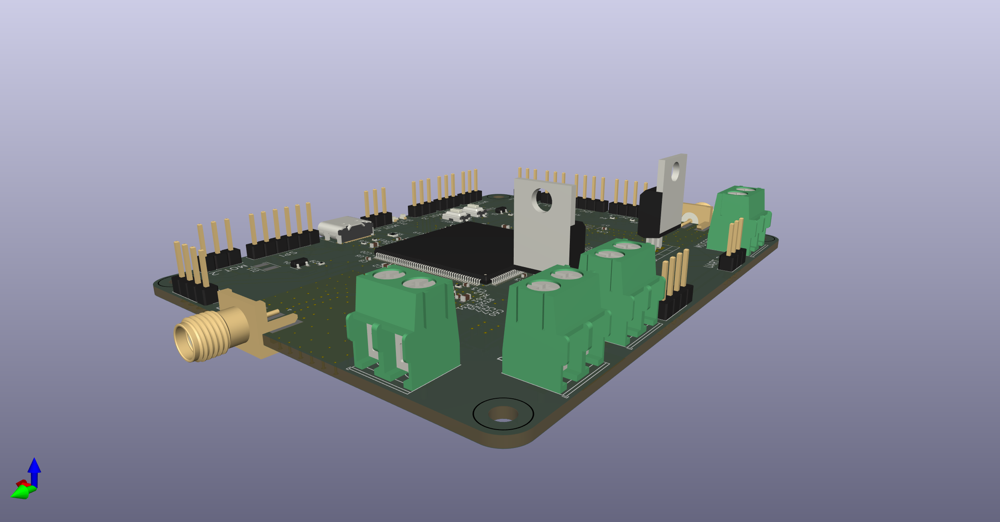

import "./drone_fc-1.png"
import "./drone_fc.png"
import "./drone_pcb.png"

# Overview

I still can't believe this was my first time using KiCAD and designing
 PCBs. A whole drone flight controller is absolutely insane for a first
 project. But here it is. The only reason I started doing this was for
 a friend of a friend - we started working on the project together, with
 the plan I would design the FC and he build the rest of the drone. Sadly,
 that never came about. But I still have this cool PCB design instead, and 
 learned so much about electronics in the process!

The controller features storage (via an SD card and flash), telemetry, a
 barometer, GPS and an IMU. That's a bit too much to explain here, but suffice
 it to say that it took quite a while to design everything, from RF to power
 and everything in-between. I also learnt how to layout a 4-layer board, which
 is cool. Overall, the experience was very useful, even if we didn't get to build
 it in the end.

# Schematic

# PCB Layout

# 3D Model
