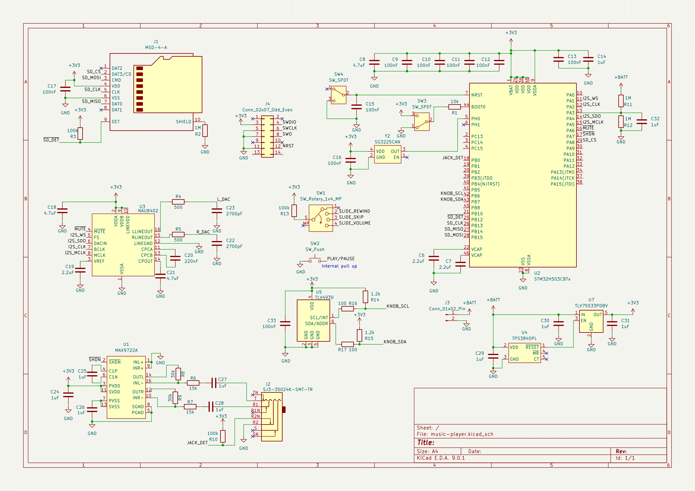

import "./schematic-1.png";

# An MP3 Player?
When my sister got back from uni, she showed me a recent purchase of hers - an
 iPod Classic. I then started wondering... could I design something
 similar? I'm sure it couldn't be that hard... And so I did. I've currently
 finished the schematic, so I've still got a lot ahead.

# Design
The overall plan is to make a portable mp3 player that you can upload songs to,
 listen to via an audio jack and also control the music - i.e. basically an iPod.
 So I decided to start with the user interface. My first idea was to have a rotating 
 wheel on the face and a slider on one of the edges. The slider would be used to 
 set different options (like skip, rewind, volume) then the wheel could be used
 to actually adjust the values. There were a couple of usability issues with this design,
 mainly that things like selecting a song or even choosing play/pause would be
 difficult, so adding a push button would be necessary. I also toyed with the idea
 of using a joystick instead of a wheel, but I think it would make the device
 significantly thicker, so I stuck with the wheel. This was where the interface design
 stuck for a long time, until I came across a [video by mitxela](https://www.youtube.com/watch?v=dLw2QQdOLaM)
 in which he used a magnet and an angle sensor to detect a rotary position. The
 benefit of this is that it is extremely low profile, making sure the device can 
 will be slim.

# Electronics
The brains behind the device will be the [STM32H503CBT7](https://www.st.com/en/microcontrollers-microprocessors/stm32h503cb.html).
 I went with this chip because:
 * I have experience with designing for STM32.
 * This chip is fast enough to perform software decoding of the audio files.
 * It comes in a nice LQFP package so I could hand solder it with just an iron.
 
 For power, I'm basically condemned to use a 3.7V LiPo, since I need a battery that
 has a large capacity, is small and is widely available. The large capacity rules out
 virtually all coin cells, so I had to go with the LiPo. To maximise battery use, I
 selected a 3.3V LDO that would track the input voltage when the output was below 3.3V + 
 the dropout voltage. This means that the device will operate at 3.3V, then track the 
 battery to 3V before shutting off (using a battery supervisor). This choice (and many 
 others) was influenced by the design of [Tangara](https://cooltech.zone/tangara/), an 
 open source MP3 player, from who's blog I learnt some tips for designing the audio 
 electronics. 

 Speaking of audio, to drive a pair of headphones, 2 ICs are necessary - a DAC and an
 Audio Amplifier. I2S data is streamed from the CPU to the [NAU8402](https://www.nuvoton.com/export/resource-files/DS_NAU8402_DataSheet_EN_Rev1.7.pdf)
 (the DAC) which provides stereo output. To ensure sufficient current output (and to be 
 able to drive even high impedance headphones) I used the [MAX9722A](https://www.analog.com/en/products/max9722a.html),
 which is a headphone amplifier with adjustable gain and good noise characteristics.
 Using a potential divider, I set the gain to 6dB, but if this isn't good in practice,
 I can always replace one of the resistors with a different value.

 As this is my first prototype, I decided to keep it simple. There is no USB or even
 charging circuitry. To recharge, you need to open the device up and charge via the JST.
 To upload any music, the player has a microSD slot which music can be loaded to. The hope
 is that the second prototype will be more featureful - have USB-C for uploading and charging,
 possibly have built-in flash for bulk storage of songs, and I would also like to implement
 more of the audio circuitry myself - with Op-Amps rather than with a premade IC. This means
 the next design will likely be more modular - I was thinking of putting all the audio circuitry
 on a separate PCB so I would only have to reprint that and could swap in the different audio
 modules.

# Schematic

The schematic needs a little tidying up, but all the components are in place.

# Conclusion
That's pretty much it for where I currently am with the project. The next steps are to:
 * Layout the PCB.
 * Print the PCB.
 * Order and Solder the parts.
 * Design and 3D Print a case.
 * Write all the software for it.
 
 Hopefully the hardest part is already over, but I'm sure that's not the case.